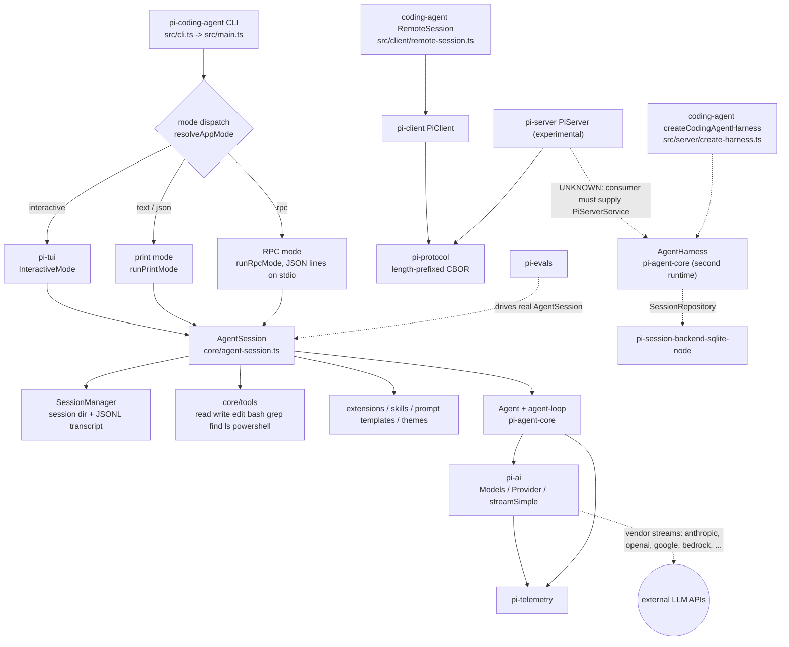

# Project Onboarding

> Generated section: revision `fb6651bc5` (branch `study`), date `2026-09-12`.
> Regenerate with `/codebase-lens`.
>
> Manual notes may be added below the generated sections; keep them outside the
> section headings listed here so regeneration can replace them.
>
> Branch note: this branch (`study`, 3 commits ahead of `main`) contains additional
> Chinese study notes under `docs/` (`docs/README.md`, `docs/01-架构总览.md` …
> `docs/16-架构与链路调用图.md`) and `.pi/SYSTEMS.md`. Those files are a prior
> session's analysis, not ground truth; where this document relies on them the
> evidence column says so. On `main` they do not exist.

## One-line overview

`pi` is a layered TypeScript monorepo whose product is `@earendil-works/pi-coding-agent`, a self-extensible terminal coding agent CLI; the other nine packages are the LLM access layer (`pi-ai`), the agent runtime and persisted-session harness (`pi-agent-core`), a terminal UI toolkit (`pi-tui`), a CBOR remote-session protocol/client/server stack, a SQLite session backend, telemetry contracts, and an evaluation harness.

## Scope and confidence

- Scope: whole repository (`/Users/hsu/workspace/pi`), all workspaces under `packages/*` and `packages/session-backends/*`. No package was excluded.
- Revision: `fb6651bc5` on branch `study`. Worktree was clean at investigation start (`git status --porcelain` empty).
- Modes: `ORIENT` (primary). `TRACE` was used for the interactive prompt path and the remote session stack; `VERIFY` was applied to the claims that the remote stack is not wired into the shipped CLI and that `docs/` is branch-local.
- Evidence limitations:
  - No `dist/` exists in the worktree, so bundling and published-artifact behavior are read from build scripts, not observed (`UNKNOWN` where noted).
  - Nothing was executed that starts the CLI, a provider request, or a test suite; all runtime claims about pi's behavior come from source plus the existing test/CI configuration.
  - The remote session stack was not run. It is declared experimental by its own README.
  - Chinese study notes under `docs/` were read for vocabulary and treated as claims; only the parts that source confirms are marked `SOURCE` here.

## Technology and commands

| Item | Value | Evidence |
|---|---|---|
| Language | TypeScript (ES2022 target, `Node16`/`NodeNext` modules, `strict`) | `tsconfig.base.json` |
| Runtime | Node.js >= 22.19.0; optional Bun-compiled standalone binary | `package.json` `engines`, `packages/coding-agent/package.json` `build:binary` |
| Package manager | npm workspaces (`packages/*`, `packages/session-backends/*`, 5 coding-agent example extensions) | `package.json:5-14` |
| Compiler | `tsgo` from `@typescript/native-preview` (`7.0.0-dev.20260120.1`), plus `typescript` 5.9.3 for scripts | `package.json` devDependencies |
| Lint/format | Biome 2.3.5, tab width 3, line width 120 | `biome.json` |
| Tests | Vitest for 9 workspaces; `node:test` for `packages/tui`; `vitest-evals` for `packages/evals` | each `packages/*/package.json` `scripts.test` |
| TUI deps | `marked`, `get-east-asian-width`, native clipboard/`photon-node` optional | `packages/tui/package.json`, bundle allowlist |
| Install | `npm install --ignore-scripts`; CI uses `npm ci --ignore-scripts` | `README.md`, `.github/workflows/ci.yml` |
| Build | `npm run build` (sequential: tui → telemetry → ai → agent → sqlite-node → protocol → client → server → coding-agent) | `package.json:16` |
| Build (offline) | `npm run build:offline` skips live model-data refresh | `package.json:17` |
| Check | `npm run check` = biome write + pinned deps + TS relative imports + shrinkwrap + install-lock + `tsgo --noEmit` + browser smoke. Does **not** run tests, and it **writes** files (`biome check --write`) | `package.json:24-31` |
| Tests (all, isolated) | `./test.sh` — scrubbed `env -i` home/tmpdir, no API keys, `PI_NO_LOCAL_LLM=1` | `test.sh` |
| Run from source | `./pi-test.sh` (tsx on `packages/coding-agent/src/cli.ts`, no build), `--no-env` unsets every provider key | `pi-test.sh` |
| Run a single vitest file | `node "$(git rev-parse --show-toplevel)/node_modules/vitest/dist/cli.js" --run test/specific.test.ts` | `AGENTS.md` |
| Packaging | `scripts/build-coding-agent-bundle.mjs` (esbuild → `dist/bundle/cli.js`); `scripts/local-release.mjs`; `scripts/release.mjs` | source |

## Architecture map



Legend: solid arrows are control/data flow confirmed in source. Dashed edges are `INFERRED` or `UNKNOWN`:

- `AI -.-> vendor streams`: provider APIs are reached through generated provider/API modules; no live call was made. `SOURCE` for the module layout, no runtime verification.
- `SERVER -.-> HARN`: `pi-server` only accepts a `PiServerService`; nothing in the repository constructs a service that serves a harness. `UNKNOWN`.
- `CODEGLUE -.-> HARN`: `createCodingAgentHarness` builds an `AgentHarness`, but the only reference in the repository is its own test.
- `EVAL -.-> AS`: `packages/evals` imports `createAgentSessionServices` / `AgentSession` from `pi-coding-agent`.

The `AgentHarness` and `AgentSession` boxes are two independent runtimes. They are not layered on each other; `AgentSession` never uses `AgentHarness`.

## Directory and component map

| Component | Responsibility | Key paths and symbols | Evidence |
|---|---|---|---|
| `pi-telemetry` (`packages/telemetry`) | Vendor-neutral observability contracts: span interfaces, typed schema definitions, noop and in-memory contexts | `src/index.ts` (`TelemetryContext`, `TelemetrySpan`, `defineTelemetrySchema`), `src/noop.ts`, `src/memory.ts`, `src/testing/` | `SOURCE`; zero workspace deps (`packages/telemetry/package.json`) |
| `pi-ai` (`packages/ai`) | Unified multi-provider LLM API: provider set, model registry, auth/credential resolution, streaming APIs, images, generated model catalog | `src/models.ts` (`Models`, `Provider`, `createModels`, `createProvider`), `src/providers/*.ts` + `*.models.ts`, `src/api/*.ts` (plus `.lazy.ts` variants), `src/auth/`, `src/models.generated.ts`, `src/cli.ts` (bin `pi-ai`) | `SOURCE`; 137 test files |
| `pi-agent-core` (`packages/agent`) | Two runtimes. (1) `Agent` + `agent-loop`: stateful transcript, steering/follow-up queues, tool execution, event stream, `transformContext`/`convertToLlm`. (2) `AgentHarness`: persisted, resumable session state machine over write-once entries, branches, lanes, registers | `src/agent.ts` (`Agent`), `src/agent-loop.ts` (`runAgentLoop`), `src/harness/agent-harness.ts` (`AgentHarness`), `src/harness/session/`, `src/harness/compaction/`, `src/harness/tools/`, `src/proxy.ts`, `docs/harness.md` | `SOURCE`; deps `pi-ai` + `pi-telemetry` |
| `pi-tui` (`packages/tui`) | Terminal UI framework: differential rendering, main/alt screens, components, editor, key bindings, terminal capabilities, images, LaTeX | `src/tui.ts`, `src/tui-main-screen.ts`, `src/tui-alt-screen.ts`, `src/components/`, `src/editor-component.ts`, `src/keybindings.ts`, `src/terminal.ts` | `SOURCE`; no workspace deps; only `node:test` user |
| `pi-coding-agent` (`packages/coding-agent`) | The product: CLI bootstrap, mode dispatch, `AgentSession` hub, built-in tools, extension/skill/template/theme loading, settings, project trust, session persistence on disk, HTML export, RPC mode, package manager, SDK surface | `src/cli.ts`, `src/main.ts`, `src/modes/` (`interactive/`, `rpc/`, `print-mode.ts`), `src/core/agent-session.ts` (`AgentSession`), `src/core/agent-session-runtime.ts`, `src/core/session-manager.ts` (`SessionManager`), `src/core/tools/`, `src/core/extensions/`, `src/index.ts` (SDK), `docs/` (published docs site, `docs.json`) | `SOURCE`; 246 test files; only package with a user-facing bin |
| Remote session stack: `pi-protocol` + `pi-client` + `pi-server` | Wire protocol (schema, CBOR codec, 4-byte big-endian length framing), transport-agnostic `PiClient`, server core `PiServer` + listeners, snapshots and leases | `packages/protocol/src/{schemas,codec,framing,cbor/}.ts`; `packages/client/src/{client,connection,session-handle,transport,unix}.ts`; `packages/server/src/{server,sessions,snapshots,listener,protocol,transports/unix}.ts`, `packages/server/src/testing/` | `SOURCE`; `pi-server/README.md` declares the package experimental and CLI-less |
| `pi-session-backend-sqlite-node` (`packages/session-backends/sqlite-node`) | `SessionRepository` implementation over `node:sqlite` for the agent harness, kept out of core so `pi-agent-core` needs no native/runtime builtins | `src/index.ts`, `src/sqlite/` | `SOURCE`; deps `pi-ai` + `pi-agent-core`; 11 test files |
| `pi-evals` (`packages/evals`, private) | Behavior evals that drive a real `AgentSession` through `vitest-evals` | `src/pi-harness.ts`, `src/smoke.eval.ts`, `src/extensions.eval.ts`, `src/vitest-evals/`, `scripts/run-evals.mjs` | `SOURCE` |
| coding-agent docs | User-facing docs shipped in the npm package and rendered by the website | `packages/coding-agent/docs/{index,quickstart,usage,providers,models,sdk,rpc,extensions,skills,packages,sessions,session-format,compaction,settings,security,containerization,...}.md` + `docs.json` nav | `SOURCE` |
| agent docs | Internal design specs | `packages/agent/docs/{harness,search,telemetry-schema}.md` | `SOURCE` |
| Root `docs/` (branch-local) | Chinese study notes from a prior session on this branch | `docs/README.md`, `docs/01-架构总览.md` … `docs/16-架构与链路调用图.md` | `SOURCE` (files exist on this branch), content `INFERRED` unless independently confirmed |

Workspace dependency edges (from each `package.json`, not from docs):

```
telemetry  <- ai, agent
ai         <- agent, server, sqlite-node, coding-agent
agent      <- sqlite-node, coding-agent
protocol   <- client, server, coding-agent
client     <- coding-agent
tui        <- coding-agent
server     <- (no workspace consumer)
sqlite-node<- (no workspace consumer)
```

`coding-agent` does not declare `pi-telemetry`, `pi-server`, or `sqlite-node` as direct dependencies; telemetry is reachable transitively through `pi-ai`/`pi-agent-core`.

## Startup and request / command lifecycle

Entry chain for the CLI:

1. `packages/coding-agent/src/cli.ts` — shebang entry, sets `process.title`, `PI_CODING_AGENT=true`, silences process warnings, calls `configureHttpDispatcher()`, then `main(process.argv.slice(2))`. `SOURCE`.
2. `packages/coding-agent/src/main.ts` (`export async function main`, line 561) — the real orchestrator. In order:
   - `runAuthCommand` (early return), then `cleanupManagedInstall` / Windows self-update cleanup. `SOURCE`.
   - `handlePackageCommand` (`pi install`/`update`/… ) and `handleConfigCommand` — early returns via `src/package-manager-cli.ts`. `SOURCE`.
   - `parseArgs` → diagnostics, `--version`, `--export` fast paths. `SOURCE`.
   - `resolveAppMode(parsed, stdin.isTTY, stdout.isTTY)` → `AppMode = "interactive" | "print" | "json" | "rpc"`; non-interactive modes `takeOverStdout()`. `SOURCE`.
   - `runMigrations(cwd)`; `SettingsManager.create(cwd, agentDir)`; optional first-time setup (interactive only). `SOURCE`.
   - Session resolution: `createSessionManager` → `SessionManager.open`/fork; `--session`/`--resume` may point at another project, so the final runtime cwd is resolved *after* session selection. `SOURCE`.
   - `createAgentSessionRuntime(createRuntime, …)` → `createAgentSessionServices` builds `SettingsManager`, `ModelRuntime`, `ResourceLoader` (extensions, skills, prompt templates, themes), then `buildSessionOptions` + `createAgentSessionFromServices` produce the `AgentSession`. `SOURCE` (`src/core/agent-session-runtime.ts`, `src/core/agent-session-services.ts`, `src/core/sdk.ts`).
   - `--help` / `--list-models` fast paths; piped-stdin reading (interactive + piped stdin degrades to print mode). `SOURCE`.
   - Dispatch: `rpc` → `runRpcMode(runtime)`; `interactive` → `new InteractiveMode(runtime, …).run()`; otherwise `runPrintMode(runtime, …)`. `SOURCE` (`main.ts:930-978`).
3. Alternate entries: `src/rpc-entry.ts` (`main(["--mode","rpc", ...])`, exported as `./rpc-entry`), `src/bun/cli.ts` (Bun compiled binary: registers Bun OAuth + Bedrock, restores sandbox env, then imports `../cli.ts`), `src/index.ts` (SDK surface, re-exports `main`).

Prompt lifecycle (local, interactive) — `TRACE`, all `SOURCE` except where noted:

```
keystroke
  -> pi-tui component / Editor            (packages/tui)
  -> InteractiveMode                      (src/modes/interactive/interactive-mode.ts)
  -> AgentSession.prompt(text, options)   (src/core/agent-session.ts:1139)
       extension "input" handlers + "/" commands
       skill command + prompt-template expansion
       if streaming: queue via steer() or followUp()
  -> Agent.prompt()                       (packages/agent/src/agent.ts)
  -> runAgentLoop()                       (packages/agent/src/agent-loop.ts)
  -> streamFn == models.streamSimple      (src/core/model-runtime.ts -> packages/ai/src/models.ts)
  -> Provider.streamSimple -> vendor API  (packages/ai/src/providers/*, src/api/*)
  <- AgentEvent stream                    (agent_start, turn_start, message_start/update/end, tool_*, agent_end)
  <- AgentSession translates + persists + renders
       SessionManager JSONL append, compaction, retry, TUI update, telemetry spans
```

Confirmed call sites on that path: `sdk.ts:306` constructs `new Agent({...})` with a `streamFn` that wraps `modelRuntime.streamSimple` (`sdk.ts:314-340`); `sdk.ts:388` constructs `new AgentSession`; `agent-loop.ts:308` is the terminal provider call (`await streamFunction(model, llmContext, {...})`); `agent-loop.ts:411-425` executes tool calls; `AgentSession._handleAgentEvent` (`agent-session.ts:623`) persists on `message_end` via `sessionManager.appendMessage` (`agent-session.ts:678-687`); `InteractiveMode` subscribes at `interactive-mode.ts:3170-3175` and submits prompts at `interactive-mode.ts:1164-1186`. Session files use `CURRENT_SESSION_VERSION = 3` (`session-manager.ts:29`).

Branches and side effects on that path: extension command interception, input transformation, streaming-time queueing (`steer` vs `followUp`), compaction lock (`Cannot submit a prompt while compaction is in progress`), tool execution via `core/tools/*` with file-mutation queueing, session persistence and branch/fork, project-trust gating before project resources load. Error/retry behavior and the exact event translation table were not traced to the end in this pass; see `docs/13-*` and `docs/15-*` (branch-local notes) and `packages/coding-agent/src/core/agent-session.ts` for that depth.

Remote session path — `TRACE`:

| Order | File and symbol | Role | Evidence |
|---|---|---|---|
| 1 | `packages/protocol/src/schemas.ts`, `cbor/`, `codec.ts`, `framing.ts` | Message schemas (`PROTOCOL_VERSION = 1`, `ClientHello`/`ServerHello`, request/response/event envelopes), CBOR encode/decode, 4-byte big-endian length framing (`encodeFrame`, `FrameDecoder`) | `SOURCE` |
| 2 | `packages/client/src/client.ts` (`PiClient`), `connection.ts`, `session-handle.ts` (`SessionLease`), `transport.ts`, `unix.ts` | Transport-agnostic client: hello handshake, then correlated `request` envelopes; exclusive/shared session lease | `SOURCE` |
| 3 | `packages/coding-agent/src/client/remote-session.ts` (`RemoteSession`), `transcript.ts` | coding-agent wrapper that applies snapshot/progress to transcript state; exported from `pi-coding-agent/client` | `SOURCE`; no non-test consumer found in-repo |
| 4 | `packages/server/src/server.ts` (`PiServer`), `sessions.ts` (`LiveSessionManager.executeCommand`), `snapshots.ts`, `listener.ts`, `transports/unix/`, `types.ts` (`PiServerService`, `PiSessionRuntime`) | Server core plus pluggable listeners; commands are `list`/`create`/`attach`/`detach`/`prompt`/`steer`/`abort`/`set_model`/`set_thinking`; a host must supply `PiServerService` (the only transport in-tree is Unix) | `SOURCE` (`packages/server/README.md`, `sessions.ts:47-115`, `types.ts:36-63`) |
| 5 | `packages/coding-agent/src/server/create-harness.ts` (`createCodingAgentHarness`) | Builds an `AgentHarness` with coding-agent tools/prompts (server-side glue) | `SOURCE`; only referenced by `packages/coding-agent/test/server/create-harness.test.ts` |

`UNKNOWN`: no in-repo code starts a `PiServer` for coding-agent sessions, so the end-to-end remote flow (client → server → harness → session snapshot) is not demonstrated by the repository today.

RPC mode is a *different* mechanism from the remote stack: `src/modes/rpc/rpc-mode.ts` speaks newline-delimited JSON over stdio (`src/modes/rpc/jsonl.ts`, `rpc-types.ts`, plus `rpc-client.ts`), for embedding the agent in other programs. It does not use `pi-protocol`. `SOURCE`.

## Project vocabulary

Use the canonical term in the left column. Aliases are given so user language can be mapped to code.

| Canonical term | Code names and aliases | Meaning and boundaries | Lifecycle / relationships | Evidence | Status |
|---|---|---|---|---|---|
| Agent | `Agent` (`packages/agent/src/agent.ts`) | In-process stateful agent: owns the transcript and options, exposes `prompt`/`steer`/`followUp`/`subscribe`, executes tools, emits `AgentEvent`s. Not the product-level session; it knows nothing about files on disk, extensions, or settings. | Created by callers; driven turn by turn by the agent loop; can be paused/resumed with queued messages | `SOURCE` (`agent.ts:173-500`) | CONFIRMED |
| agent loop | `runAgentLoop`, `runAgentLoopContinue` (`agent-loop.ts`) | One turn of "assistant response → tool calls → tool results" with sequential/parallel tool execution, retry, early-stop hooks. Lower-level than `Agent`, which wraps it. | Called from `Agent.prompt()`; receives `streamFn` | `SOURCE` (`agent.ts:414,427`) | CONFIRMED |
| AgentHarness | `AgentHarness` (`packages/agent/src/harness/agent-harness.ts`), package `pi-agent-core`, docs `packages/agent/docs/harness.md` | A **second, independent runtime**: a persisted, resumable session state machine (write-once entries + registers + branches/lanes/facts) with compaction, fork, crash recovery, and pluggable `SessionRepository` storage. It does not use `Agent`/`agent-loop`, and `AgentSession` does not use it. | Storage backends: in-memory, JSONL (reference), SQLite (`pi-session-backend-sqlite-node`). Consumed in-repo only by `createCodingAgentHarness` and evals-adjacent code | `SOURCE` (`packages/agent/docs/harness.md:1-250`, `index.ts` exports) | CONFIRMED |
| AgentSession | `AgentSession` (`packages/coding-agent/src/core/agent-session.ts`), "session" in CLI output | coding-agent's hub around `Agent`: translates agent events, persists to disk, runs compaction/retries, holds model + thinking level + tools, serves extensions and UI. This is what users mean by "a session" in `pi`. | Built by `createAgentSessionFromServices`; mounted in `AgentSessionRuntime`; persisted by `SessionManager` | `SOURCE` (`agent-session.ts:310`, `:1139`) | CONFIRMED |
| AgentSessionRuntime | `AgentSessionRuntime`, `createAgentSessionRuntime` (`src/core/agent-session-runtime.ts`) | Wrapper holding the current `AgentSession` plus its services so the session can be reloaded/re-created with a new cwd or settings (e.g. opening a session from another project) without restarting the process. | Created in `main.ts`; passed to interactive/print/RPC modes | `SOURCE` | CONFIRMED |
| SessionManager | `SessionManager` (`src/core/session-manager.ts`) | coding-agent's on-disk session store: a session directory per session with a JSONL transcript plus metadata; supports list/open/fork/append/export. **Distinct from** the harness `SessionRepository`/`Session`. | Used by `main.ts`, `AgentSession`, and `pi-evals` | `SOURCE`; see also `packages/coding-agent/docs/session-format.md` | CONFIRMED |
| SessionRepository / Session | `SessionRepository`, `Session`, plus `Entry`, `Register`, `Lane`, `Fact` (`packages/agent/src/harness/session/`) | Storage contract for the `AgentHarness` runtime: append-only entries, register namespaces, branch queries. The term "session" here means harness state, not a file on disk. | Implemented by memory, JSONL, and SQLite backends | `SOURCE` (`docs/harness.md` Part 1) | CONFIRMED |
| Provider | `Provider`, `createProvider` (`packages/ai/src/models.ts`) | Runtime unit of LLM access: id/name, auth method (API key or OAuth), model list, streaming implementation. One provider can own many models. | Registered into `Models`; owns `streamSimple`/`stream` | `SOURCE` (`models.ts:97-160`) | CONFIRMED |
| Models | `Models`, `MutableModels`, `createModels()` (`packages/ai/src/models.ts`) | The registry/router: holds providers, resolves credentials, and dispatches each request to the provider owning the requested model. All models are expected to support tool calling. | Built once per process (or per runtime); wrapped by coding-agent's `ModelRuntime` | `SOURCE` (`models.ts:156-240`) | CONFIRMED |
| ModelRuntime | `ModelRuntime` (`src/core/model-runtime.ts`), implements `Models` | coding-agent's `Models` implementation: adds credential storage/sync, catalog refresh, runtime API-key overrides, offline behavior. Internals use it directly. | Constructed by `createAgentSessionServices`; wrapped for extensions by `ModelRegistry` | `SOURCE` (`model-runtime.ts:130`) | CONFIRMED |
| ModelRegistry | `ModelRegistry` (`src/core/model-registry.ts`) | Synchronous compatibility facade over `ModelRuntime`, exposed to extensions; coding-agent internals use `ModelRuntime`. | Passed to `ExtensionRunner` (`getModelRegistry()`) | `SOURCE` (`model-registry.ts:32`) | CONFIRMED |
| ModelsStore | `ModelsStore`, `InMemoryModelsStore` (`packages/ai/src/models-store.ts`), `InMemoryCodingAgentModelsStore`, `FileModelsStore` (`src/core/models-store.ts`) | Persistence/caching of model catalog data, separate from the `Models` registry. | Used by `ModelRuntime` refresh logic | `SOURCE` | CONFIRMED |
| generated model catalog | `packages/ai/src/models.generated.ts`, `image-models.generated.ts`, `*.models.ts` | Generated model metadata (ids, limits, pricing, thinking support). Never edited by hand; regenerate via `packages/ai/scripts/generate-models.ts` / `generate-image-models`. | Consumed by providers and `Models` | `SOURCE`; `AGENTS.md` forbids direct edits | CONFIRMED |
| thinking level | `ThinkingLevel`, `setThinkingLevel`, `getSupportedThinkingLevels`, `clampThinkingLevel` | Per-request reasoning-effort setting; providers map it to their own thinking/extended-thinking parameter. Levels are model-dependent and clamped. | Stored on the session; set via `--thinking`, settings, or model shorthand | `SOURCE` (`models.ts:902-938`) | CONFIRMED |
| compaction | `compact`, `shouldCompact`, `prepareCompaction`, `estimateContextTokens`, branch summarization (`packages/agent/src/harness/compaction/`); `src/core/compaction/` | Shrinking a long transcript by summarizing older turns (or a branch) when context limits approach. | Triggered by `AgentSession`; documented in `packages/coding-agent/docs/compaction.md` | `SOURCE` | CONFIRMED |
| tool | `createReadTool`/`createEditTool`/`createWriteTool`/`createBashTool`/`createGrepTool`/`createFindTool`/`createLsTool`/`createPowerShellTool` (`src/core/tools/`), `Tool`, `HarnessTool`/`AgentHarnessTool` | Built-in capabilities the model can call. Each comes in a runtime form (`createXTool`) and a definition form (`createXToolDefinition`) for extension/UI registration. | Registered per session; `--tools`/`--exclude-tools`/`--no-tools` filter them | `SOURCE` (`core/tools/index.ts`) | CONFIRMED |
| extension | `ExtensionRunner`, `InlineExtension`, `builtInExtensions`, `src/core/extensions/` | TypeScript module that hooks agent/session events and can register tools, commands, flags, UI, and providers. The core is intentionally minimal; features belong here. | Loaded by `ResourceLoader` from user/project/global locations; failure is a diagnostic | `SOURCE`; `CONTRIBUTING.md`, `packages/coding-agent/docs/extensions.md` | CONFIRMED |
| skill | `Skill`, `src/core/skills.ts` | A Markdown instruction file (`SKILL.md`-style) that the agent can load on demand; invoked from the prompt as a slash command. | Discovered by `ResourceLoader`; expanded inside `AgentSession.prompt` | `SOURCE` (`skills.ts`, `docs/skills.md`) | CONFIRMED |
| prompt template | `PromptTemplate`, `src/core/prompt-templates.ts`, `expandPromptTemplate` | A reusable prompt snippet expanded from `/name` in the input. | Expanded in `AgentSession.prompt` | `SOURCE` | CONFIRMED |
| theme | theme JSON under `src/modes/interactive/theme/`, `initTheme` | Colors/styles for the TUI. | Loaded at startup; watched for changes | `SOURCE` | CONFIRMED |
| context files | `loadProjectContextFiles`, `AGENTS.md`/`CLAUDE.md` handling | Project instruction files injected into the system prompt. | Loaded by `ResourceLoader` (gated by project trust) | `SOURCE` (`resource-loader.ts`) | CONFIRMED |
| pi package | `pi install`, `pi remove`, `DefaultPackageManager`, `pi` key in `package.json` | A **user-installed bundle** of extensions/skills/prompt templates/themes distributed via npm or git. Collides with "package" meaning an npm workspace package; say "pi package" for the former, "workspace package" for the latter. | Recorded in user or project settings; project packages auto-install after trust | `SOURCE`; `docs/packages.md:3-5` | CONFIRMED |
| mode / AppMode | `AppMode = "interactive" \| "print" \| "json" \| "rpc"`, `Mode = "text" \| "json" \| "rpc"`, `resolveAppMode` | How the process talks to a caller. `interactive` = TUI; `print`/`json` = one-shot non-interactive output; `rpc` = headless JSON-lines over stdio. | Resolved in `main.ts` from TTY state and `--mode`; dispatches to `InteractiveMode`, `runPrintMode`, or `runRpcMode` | `SOURCE` (`cli/args.ts:11`, `core/project-trust.ts:12`) | CONFIRMED |
| RPC mode | `runRpcMode`, `RpcCommand`, `RpcResponse`, `RpcClient`, `src/modes/rpc/` | Headless stdio JSON protocol (`{type, id}` commands in, responses plus `AgentSessionEvent`s out) for embedding pi in other programs. **Not** the remote-session protocol. | `--mode rpc` or the `./rpc-entry` export | `SOURCE` (`rpc-mode.ts` header comment, `docs/rpc.md`) | CONFIRMED |
| remote session | `PiClient`, `PiSessionHandle`, `SessionLease`, `ServerSnapshot`, `SessionSnapshot`, `TranscriptProgress`, `RemoteSession`, `PiServer`, `PiServerService`, `PiServerListener` | The CBOR protocol stack: length-prefixed binary messages, snapshots as authoritative state, progress as hints, leases for exclusive/shared ownership. Distinct from RPC mode and from `AgentSession`. | Client side in `pi-client`; server side in `pi-server`; host supplies `PiServerService`; coding-agent adds `RemoteSession` (client) and `createCodingAgentHarness` (server) | `SOURCE` (`packages/protocol/src/schemas.ts`, `packages/server/README.md`) | CONFIRMED for the contracts; `UNKNOWN` for an in-repo end-to-end host |
| telemetry span/schema | `TelemetryContext`, `TelemetrySpan`, `defineTelemetrySchema`, `startHarnessSpan`, `startAiSpan` | Vendor-neutral tracing: spans with attributes/events/status plus typed schema definitions that constrain allowed attributes. | `NOOP_TELEMETRY_CONTEXT` by default; in-memory implementation for tests | `SOURCE` (`packages/telemetry/src/index.ts`, `packages/agent/src/harness/telemetry.ts`) | CONFIRMED |
| eval | `pi-evals`, `src/pi-harness.ts`, `*.eval.ts`, `vitest-evals` | Tests that assert agent *behavior* by running a real `AgentSession` (e.g. does a tool get called, does a skill load), as opposed to unit tests of internals. | Run with `npm run eval`; gated on model/provider availability | `SOURCE` (`packages/evals/README.md`, `src/pi-harness.ts`) | CONFIRMED |
| harness (overloaded) | `AgentHarness` vs `createCodingAgentHarness` vs `vitest-evals/harness` (`Harness`, `createHarness` in `packages/evals`) | Three different things share the word: agent-core's persisted runtime, coding-agent's server glue that constructs it, and the eval framework's test-harness abstraction. Always qualify which one. | — | `SOURCE` | CONFIRMED (collision) |
| session (overloaded) | `AgentSession` vs `SessionManager` directory vs harness `Session`/`SessionRepository` vs protocol `SessionSnapshot`/`SessionMetadata` vs an RPC session | Five different scopes share the word. Prefer a qualified phrase ("agent session", "session directory", "harness session", "remote session", "RPC session"). | — | `SOURCE` | CONFIRMED (collision) |
| `study` branch docs | `docs/*.md` (Chinese), `docs/16-架构与链路调用图.md` | Prior session's deep-dive notes: per-package summaries, event-flow analysis, key-design writeups, Mermaid call graphs. Useful index, but unverified against source and absent on `main`. | Reading aid only | `SOURCE` (files exist), content `INFERRED` | CANDIDATE |
| `SYSTEMS.md` | `.pi/SYSTEMS.md` | A persona/system prompt for a code-interpretation assistant, stored in the repo's `.pi` directory. It is *not* project documentation or a runtime component; it is prompt text for an agent session. | Loaded only if a session references it | `SOURCE` (file contents) | CONFIRMED |

## Important configuration and external dependencies

- User/project state lives under `~/.pi` (`APP_NAME = "pi"`, `CONFIG_DIR_NAME = ".pi"`); `getAgentDir()` returns `~/.pi/agent`, and settings/auth/models live at `settings.json`, `auth.json`, `models.json` inside it. Environment overrides: `PI_CODING_AGENT_DIR`, `PI_CODING_AGENT_SESSION_DIR`. `SOURCE` (`src/config.ts:498-554`).
- Provider API keys are environment-driven (`packages/ai/src/env-api-keys.ts`); `pi-test.sh --no-env` unsets the full list. Tests gate provider calls on the same variables.
- `PI_OFFLINE=1` disables network refreshes and the version check; coding-agent's vitest config sets it by default and tests opt back in via `allowNetwork()` (`test/test-network-env.ts`).
- External services: vendor LLM APIs (Anthropic, OpenAI, Google, Amazon Bedrock, Cloudflare, Groq, Mistral, xAI, DeepSeek, HuggingFace, GitHub Copilot, OpenRouter, and more under `packages/ai/src/providers/`), OAuth flows (`src/auth/oauth/`, `bun-oauth` export), and optional `@silvia-odwyer/photon-node` / clipboard natives that are lazily required and have JS fallbacks.
- Supply-chain rules are part of the architecture: exact-pinned direct deps, `save-exact=true`, `min-release-age=2`, `package-lock.json` as ground truth, commit blocked unless `PI_ALLOW_LOCKFILE_CHANGE=1`, generated `packages/coding-agent/npm-shrinkwrap.json` and `install-lock/` with an explicit install-script allowlist. `SOURCE` (`README.md`, `AGENTS.md`, `scripts/generate-coding-agent-shrinkwrap.mjs`).
- Model metadata is refreshed from live provider catalogs at build time (`generate:models`, `hydrate:model-data`, `check:model-data`) and published as a model catalog (`publish-model-catalog.mjs`, hourly weekday workflow).
- `pi-server` is explicitly experimental ("may change or be removed without notice"): `packages/server/README.md`.

## Conventions and testing

- Code conventions (also see root `AGENTS.md`):
  - Erasable TypeScript only (`erasableSyntaxOnly: true`): no `enum`, no parameter properties, no `namespace`/`module`, no `import =`/`export =`.
  - Top-level imports only; no inline/dynamic `import()`. Relative imports use `.ts` extensions (`check:ts-imports` enforces this; `rewriteRelativeImportExtensions` emits `.js`).
  - Biome formats with tabs (width 3), line width 120; `noExplicitAny` and `noNonNullAssertion` are off, so `any` is legal but AGENTS.md forbids it unless necessary.
  - Keybindings must go through `DEFAULT_EDITOR_KEYBINDINGS` / `DEFAULT_APP_KEYBINDINGS` rather than hardcoded key checks.
  - `npm run check` after code changes; it modifies files (biome `--write`), so run it before reviewing a diff.
  - Changelogs per package under `## [Unreleased]`; never modify released sections.
- Test layout: `packages/<pkg>/test/`. coding-agent adds `test/suite/` (harness + faux provider, mandated for suite tests) and `test/suite/regressions/<issue>-<slug>.test.ts`. All vitest configs alias workspace imports to sibling `src/`, so tests run against source without building. `packages/tui` is the only `node:test` workspace.
- Provider-dependent tests skip themselves when credentials are absent; CI runs the full suite with no keys, so a green CI run does not exercise live provider code.
- CI (`ci.yml`): on `main` push/PR → apt system deps → `npm ci --ignore-scripts` → `build` → `check` → `test`. Release publishing runs through `build-binaries.yml` on `v*` tags with npm trusted publishing and an R2 release marker; `pr-gate.yml` / `issue-gate.yml` / `approve-contributor.yml` implement the maintainer approval gate described in `CONTRIBUTING.md`.
- Release: lockstep versions across all workspace packages, enforced by `scripts/sync-versions.js`; `scripts/release.mjs` bumps, rewrites changelogs, regenerates artifacts, runs check/build/test, tags, and pushes. Details in `AGENTS.md`.
- `packages/evals` is private, has no `dependencies`/`exports`, and resolves everything through tsconfig/vitest aliases; it is not part of `npm run build`.

## Recommended reading order

1. `README.md` — package inventory and the project's self-extensible framing.
2. `packages/coding-agent/src/main.ts` — the CLI brain: flags, session selection, runtime construction, mode dispatch. Read this before any other source file.
3. `packages/coding-agent/src/cli.ts` — 21-line bootstrap; confirms how the process starts.
4. `packages/coding-agent/src/core/agent-session.ts` — the hub. Skim the public methods first (`prompt`, streaming queueing, compaction, event handling).
5. `packages/coding-agent/src/core/agent-session-runtime.ts` and `agent-session-services.ts` — how services, settings, and reloads are assembled.
6. `packages/coding-agent/src/core/session-manager.ts` — the on-disk session format and branching model.
7. `packages/agent/src/agent.ts` then `agent-loop.ts` — the actual turn loop, event vocabulary, and tool execution.
8. `packages/ai/src/models.ts` — `Provider`/`Models` contracts that everything above depends on.
9. `packages/agent/docs/harness.md` — the *other* runtime. Read after the `AgentSession` path so the two are not confused.
10. `packages/protocol/src/schemas.ts` + `packages/server/README.md` — the remote contract and its experimental status.
11. `packages/tui/src/tui.ts` — differential rendering entry point, only if you are working on the UI.
12. `docs/README.md` and `docs/16-架构与链路调用图.md` (branch-local, Chinese) — a secondary index of the same system, useful for a fast alternative overview once you can judge its accuracy.

## Open questions and verification gaps

- `UNKNOWN` — Whether `pi-server` + `createCodingAgentHarness` + `RemoteSession` are exercised end-to-end anywhere outside tests. Nothing in-repo hosts a server. Their `CHANGELOG.md` files and `prepublishOnly` scripts suggest they are published standalone. Note also that `AgentHarness.create` throws `HarnessNotImplemented("create.restore")` when a session already has records (`packages/agent/src/harness/agent-harness.ts:347-354`), so restore-on-attach is incomplete for a would-be server host.
- `UNKNOWN` — Remote tool-set parity: `createCodingAgentHarness` registers only read/bash/edit/write (`create-harness.ts:100-134`), while the SDK path also has grep/find/ls/powershell. Do not assume the remote agent exposes the same tools as the CLI.
- `UNKNOWN` — How tool execution errors, retries, and abort interact across `Agent`, `AgentSession`, and the TUI in detail; only the entry points were verified here. `docs/12-*`, `docs/13-*`, and `docs/15-*` claim to cover this but were not independently checked.
- `UNKNOWN` — Exact behavior of `scripts/check-browser-smoke.mjs` pass criteria, and `.github/APPROVED_CONTRIBUTORS` contents.
- `UNKNOWN` — `packages/evals` real dependency edges (its `package.json` declares none; edges come from tsconfig/vitest aliases).
- `INFERRED` — `tsgo` is assumed to be the `@typescript/native-preview` binary from the dev dependency; not confirmed by inspecting the binary.
- `CONTRADICTED` (minor) — `docs/README.md` presents `pi-server`/`pi-client`/`pi-protocol` as the way pi sessions are "exposed to remote", while `packages/server/README.md` states the package provides no coding-agent service and applications must supply one. `docs/16-架构与链路调用图.md` additionally labels the transport "WebSocket/Unix" and the remote runtime as `AgentSession`; in-tree only a Unix transport exists (`packages/server/src/transports/`, `packages/client/src/unix.ts`) and the only coding-agent remote-runtime bridge builds an `AgentHarness`. Treat those doc claims as unverified for this revision.
- Not checked at all: interactive TUI behavior, extension loading precedence and trust semantics, Windows/PowerShell tool paths, image handling, HTML session export, `pi update --self`, and the parent-package publishing pipeline beyond its scripts.
- No build, test, or CLI run was performed, so every statement about produced `dist/` artifacts and bundle contents is static.
