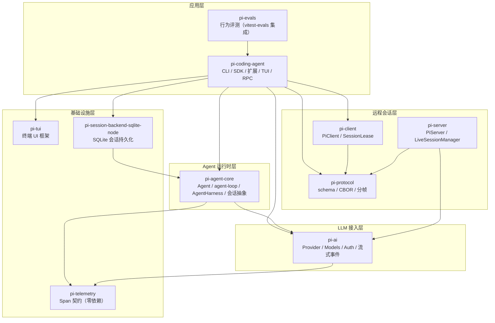
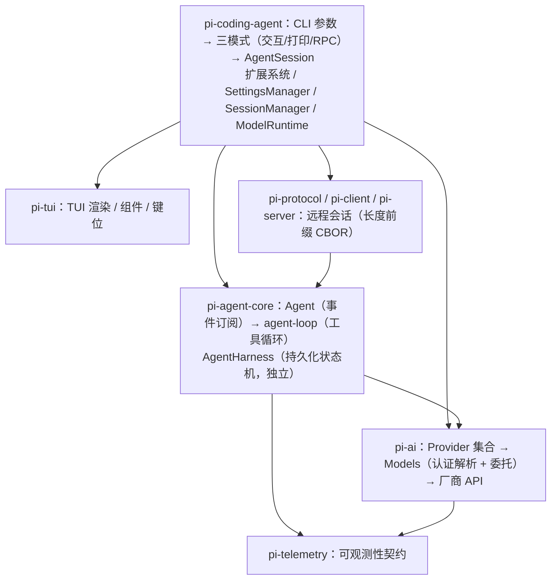
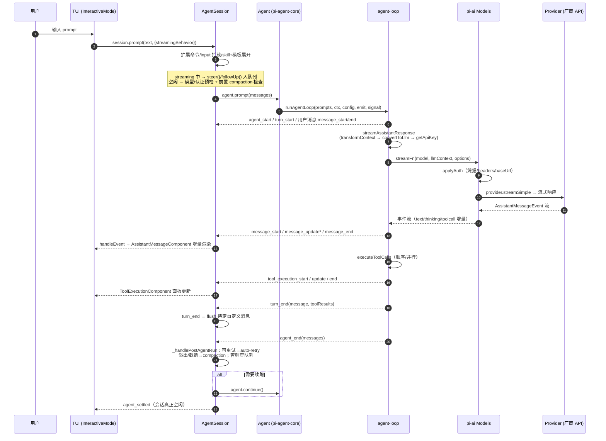
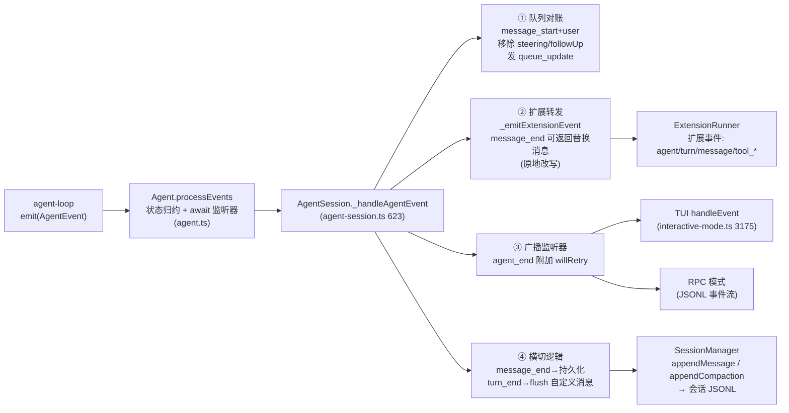
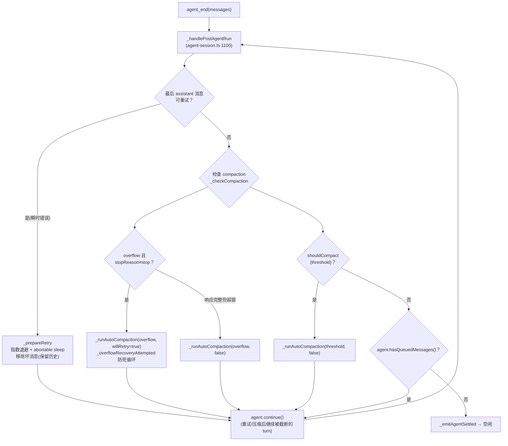
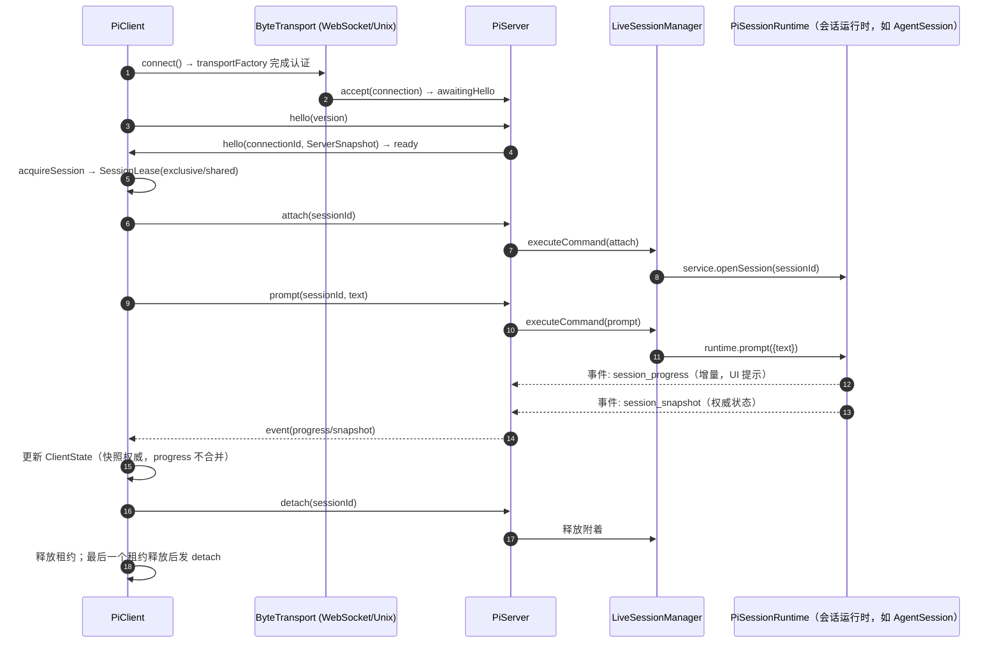
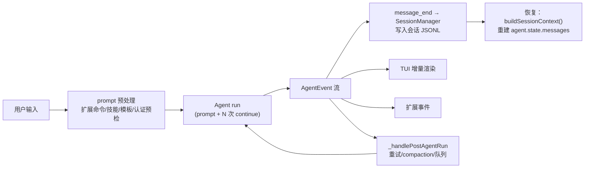

# 架构图与链路调用图

Mermaid 图，在支持 Mermaid 的 Markdown 渲染器（GitHub、VS Code、Obsidian 等）中直接可看。

## 1. 总体架构图（包依赖）

## 2. 分层视图

## 3. 交互模式提示的链路调用图（一次完整 run）

## 4. 事件上行分发链路（AgentEvent → 各消费者）

## 5. run 收尾决策链路（_handlePostAgentRun）

## 6. 远程会话链路（pi-client ↔ pi-server）

## 7. 数据流一图流（用户输入 → 持久化）

